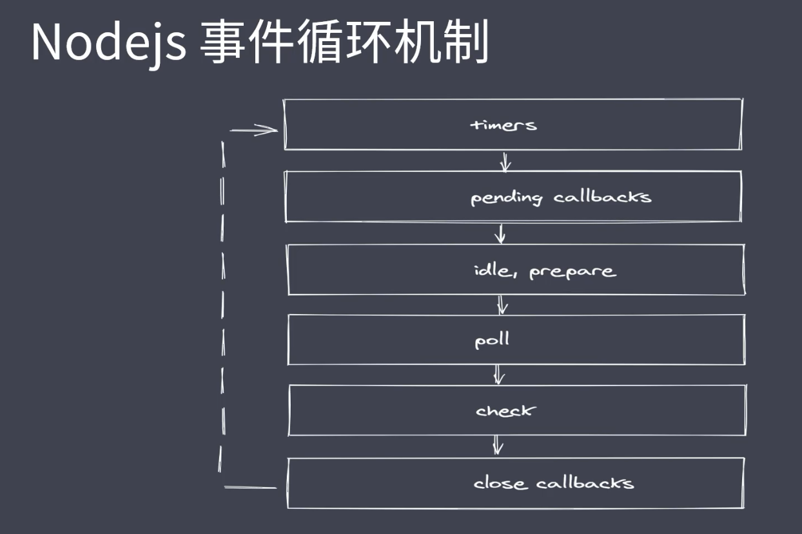
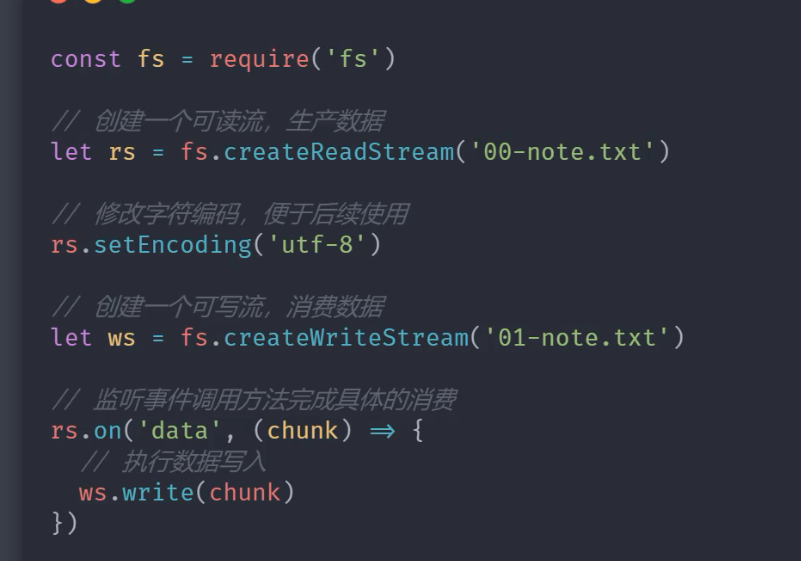

# node 的单元测试
# 代码的覆盖率 持续集成

### 常见全局变量
* __filename: 返回正在执行脚本文件的绝对路径
* __durname: 返回正在执行脚本所在目录
* timer类函数: 执行顺序与事件循环间的关系
* process: 提供与当前进程互动的接口
* require: 实现模块的加载
* module , exports:处理模块的导出

### path 模块常用API
* bassename() 获取路径中基础名称
* dirname() 获取路径中目录名称
* extname()获取路径中扩展名称
* isAbsolute() 获取路径是否为绝对路径
* join() 拼接多个路径片段
* rsolve() 返回绝对路径
* pasre() 解析路径
* format() 序列化路径
* normalize() 规范化路径

### buffer 数据流
#### 创建 Buffer 实例

* alloc:创建指定字节大小的 buffer
(不安全)
* allocUnsafe: 创建指定大小的 buffer
* from : 接收数据，创建 buffer
#### 实例方法
* fill 使用数据填充buffer
* write: 向buffer中写入数据
* toString: 从buffer中提取数据

### fs 模块
#### 常见 flag 操作符
* r: 表示可读r
* w: 表示可写W.
* s:表示同步
* +:表示执行相反操作
* x:表示排它操作
* a:表示追加操作a.
#### fd 就是操作系统分配给被打开文件的标识

### 文件操作

* readFile:从指定文件中读取数据
* writeFile:向指定文件中写入数据
* appendFile: 追加的方式向指定文件中写入数据
* copyFile:将某个文件中的数据拷贝至另一文件
* watchFile:对指定文件进行监控

### md 转html实现

### 文件打开与关闭

### 常见目录操作api
* access:判断文件或目录是否具有操作权限
* stat:获取目录及文件信息
* mkdir : 创建目录
* rmdir: 删除目录
* readdir: 读取目录中内容
*  unlink:删除指定文件

### 事件模块

### 发布订阅

### 浏览器中的Eventloop

### 核心模块Stream 
 