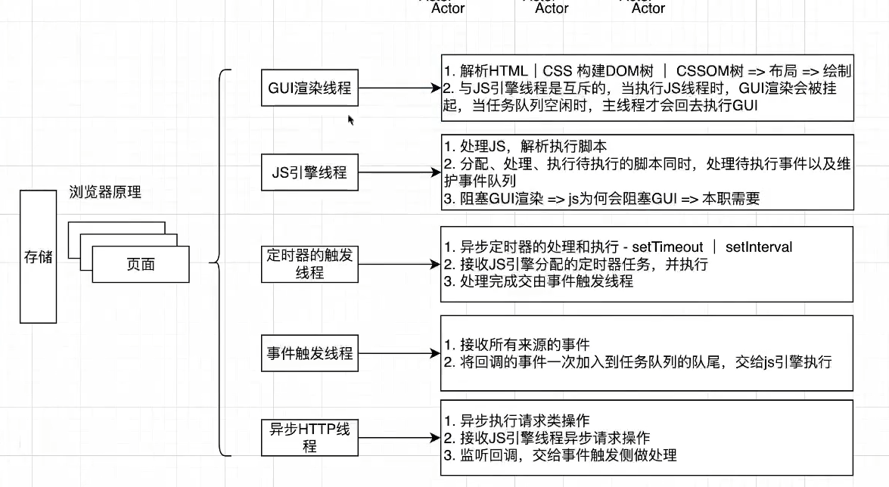

### xss 和 csrf 攻击的区别

###  浏览器原理 


### 浏览器事件
```js
    el.addEventListener(event, function, useCaption)
    //1 阻止事件传播
    event.stopPropagation() // 无法阻止默认事件的发生 比如a标签跳转
    // 如何阻止默认事件
    event.preventDefault()
    // 相同节点绑定了多个同类事件，如何阻止?
    event.stopImmediatePropagation();

```