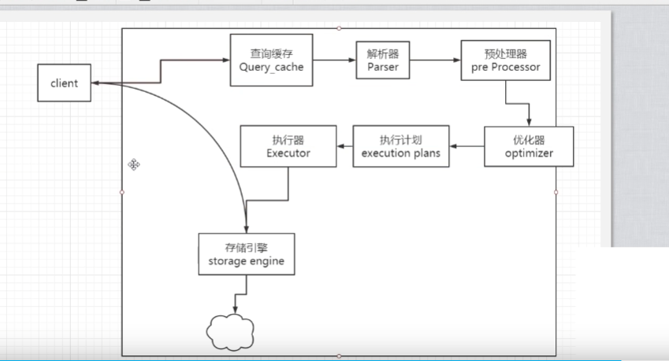
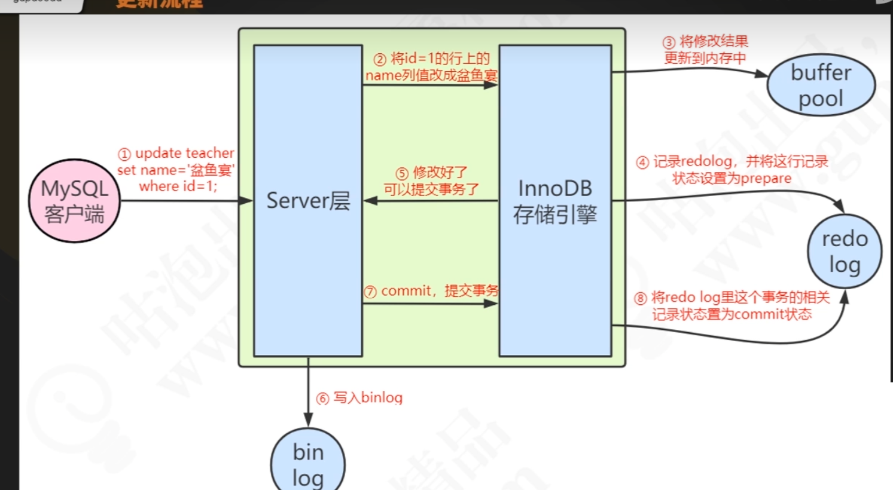
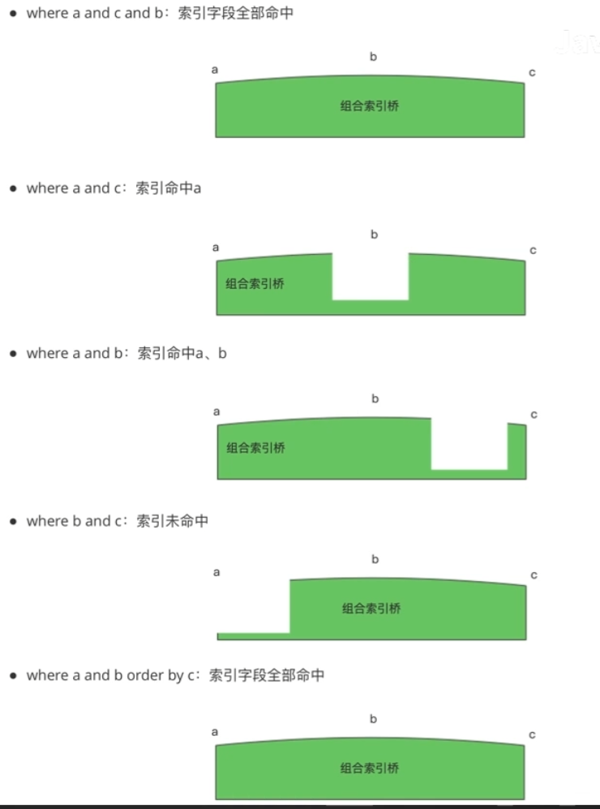
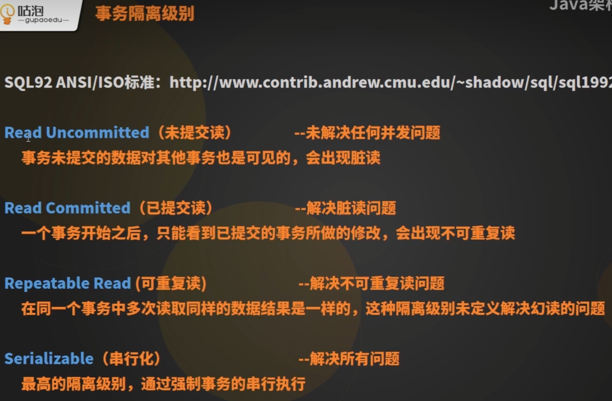
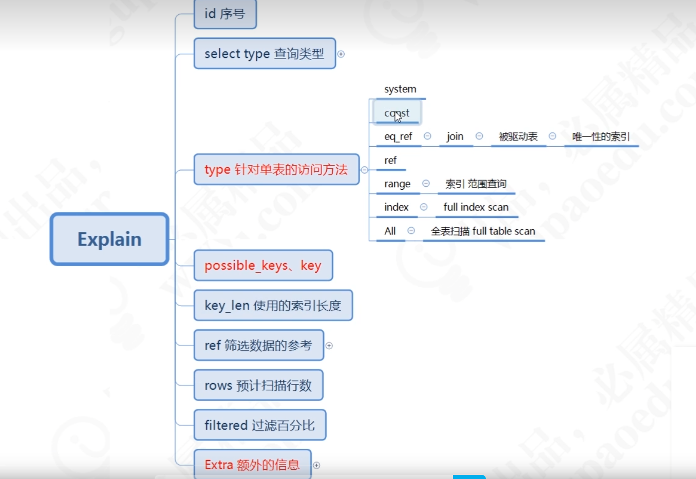

## mysql 学习笔记
### 链接方式
* TCP
* 长连接
* 同步

### 操作
* show global variable
 like ''
* SELECT * FROM  `user_innodb
` where name = '青山' 
### 词法解析 语法解析

* EXOLAIN  模拟执行

### 存储引擎
1 table  a 
速度 快 持久化-RAM

2 table b
历史数据的存储:压缩 不支持修改

3 table c 
读写并发 数据一致性要求高

### 更新数据的过程
1,
disk-buffer pool- Server

2 server 修改  data = '修改'
3 记录 undo log
4 记录 redo log
5 buffer pool
6 commit
### undo log
> 撤销日志 回滚日志
### redo log
> 事务日志
* 记录数据页的改动, 属于物理日志
* 大小固定, 前面的内容会被覆盖
* 在 innoDB存储引擎层实现
* 用于崩溃恢复
### binlog
* 记录DDl和DML的语句,属于逻辑日志
* Server 层实现, 可以被所有存储引擎
* 没有固定大小限制  内容可以追加
* 用于数据恢复和主从复制

### canal 阿里

> 用文字或者图片描述一
条查询语句 (select) 的执行流程
> B + Tree有哪些特性 这些特性在索引中带来哪些优势?

### 数据库索引到底是什么?
> 数据库索引, 是数据库管理系统(DBMS) 中一个排序的数据结构,以协助快速查询, 更新数据表中的实时数据

### 给字段添加索引
* Normal
* Unique  必须唯一
* Full Text        (非空)主键索引
### 二分查找树

### 平衡二叉树
> 平衡二叉树: 左右子树深度差绝对值不能超过1

### 多路平衡查找树 B Tree

* 节点拥有的子树数量称为度
* 关键子树: N
* 度: N

### B+Tree的特点
* B tree 能解决的问题,B+Tree都能解决
* 扫库,扫表能力强
* 磁盘读写能力更强
* 排序,范围查找能力更强
* 效率更加稳定

### innoDB 主键索引
> 如果有主键 - 一定是聚集索引

* 主键索引: 存储索引和数据
* 辅助索引: 储存索引和主键值
### 联合索引 的最左匹配原则
> 查询条件使用的字段必须从索引的最左边的字段开始，不能跳过，不能中断

### 覆盖索引

### innoDB的原子性(atomicity), 持久性(durability), 隔离性(isolation) 是怎么实现的

###  数据库事务的四大特性 

* 原子性 (保持数据数据一致性) 依赖 undo log 回滚实现
* 持久性  (崩溃恢复 redo log)
* 隔离性  
* 隔离性

### 开启事务的条件
1 DML自动开启事务
2 begin 
### 结束事务
自动提交 commit
rollback

### 行锁与表锁的区别
* 锁定粒度: 表锁> 行锁
* 加锁效率: 表锁 >行锁
* 冲突概率: 表锁 > 行锁
* 并发性能: 表锁 行锁

### 行锁: 共享锁 (Shared Locks)
> 共享锁，又称为读锁，简称S锁。共享锁就是多个事务对于同一数据可以共享一把锁，都能访问到数据，但是只能读不能修改;
* 加锁: select * from student where id=1 LOCK IN SHARE MODE:
* 释放锁: 事务结束

### 行锁: 排它锁(Exclusive Locks)
> 排他锁又称为写锁，简称X锁。排他锁不能与其他锁并存，如一个事务获取了一个数据行的排他锁，其他事务就不能再获取该行的锁(共享锁、排他锁) ，只有该获取了排他锁的事务是可以对数据行进行读取和修改。
####  加锁: 
* 自动: delete /update /insert 默认加上X锁
* 手动: select * from student where id=1 FOR UPDATE;
#### 释放锁: 事务结束。

### 行锁的原理
1 不使用索引
2 主键索引
3 唯一索引

