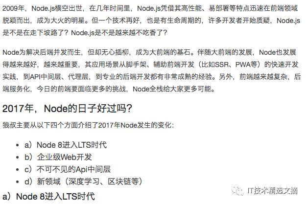
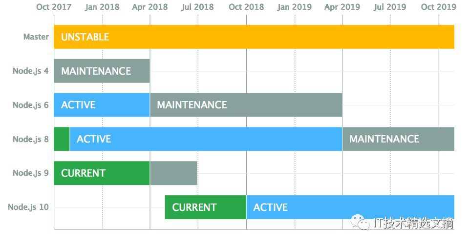
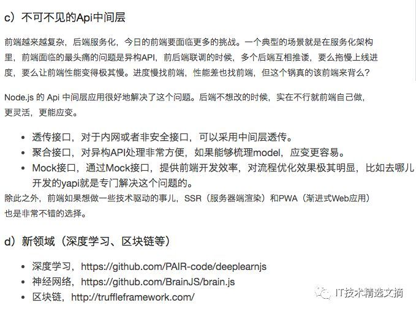
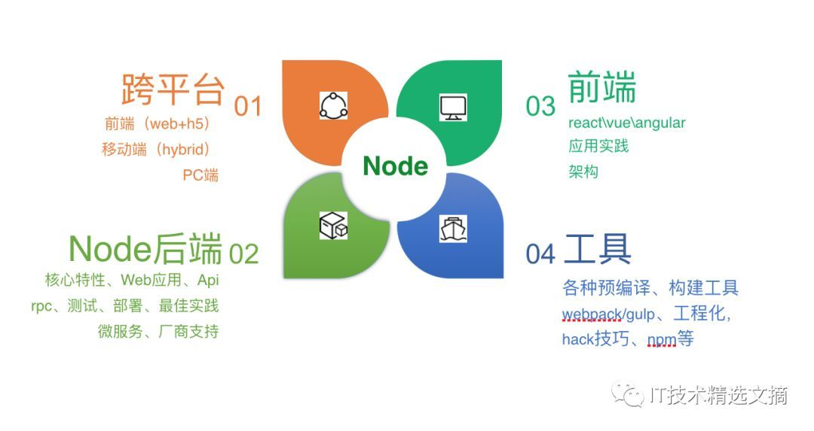

# Node全栈为前端带来更多可能
<i> 引用腾讯云 </i>
 

2017年，Node.js最大的变化是进入Node 8时代，它是一个稳定的长期支持版本（LTS），除了性能提升外，还有以下几个要点。
+Async/Await支持。其实在Node.js v7.6就可以通过flag支持了，在node8里直接落地。通过Async函数可以更好的进行异步流程控制，远离Callback Hell。在Async函数里，你可以通过await调用Promise，以及通过co包裹的generator，可以说，向前是完美的Async函数，向后也完美兼容各种遗留代码，称为异步终极解决方案不为过。

+ ES6模块支持。通过vue/react、webpack、babel和typescript等火爆发展，es6模块得到了广泛普及和应用，在Node.js v8.5可以通过
+ experimental-modules来开启这个体验版特性。当然，你想在Node.js更早版本里使用ES6模块，可以采用@std/esm模块。
+ HTTP2支持。在Node.js v8.8就开始默认启用了，http2对服务器端推送，多通道复用等特性，能够更好地为浏览器便利，是性能优化的利器。

Node v9.9对ES2018支持是75%，在Node v10里支持是100%，更多信息参见http://node.green/#ES2018
#### b）企业级Web开发
基础框架除了应用最广泛的主流Web框架Koa外，Fastify也是一直劲敌，作者 Matteo Collina 是 Node.js 核心开发，Stream 掌门，性能优化专家。Fastify 基于 Schema 优化，对性能提升极其明显。这里介绍3个知名框架。
b1）Egg.js

阿里开源的企业级 Node.js 框架 Egg 发布 2.0，基于 Koa 2.x，异步解决方案直接基于 Async Function。框架层优化不含 Node 8 带来的提升外，带来 30% 左右的性能提升。

Egg 采用的是 『微内核 + 插件 + 上层框架』 模式，对于定制，生态，快速开发有明显提升，另外值得关注的是稳定性和安全上，也是极为出色的。

b2）Nest

Nest是基于TypeScript和Express的企业级Web框架。

很多人开玩笑说，Nest是最像Java开发方式的，确实，Nest采用TypeScript作为底层语言，TypeScript是ES6超集，对类型支持，面向对象，Decorator（类似于Java里注解Annotation）等支持。在写法上，保持Java开发者的习惯，能够吸引更多人快速上手。

TypeScript支持几乎是目前所有Node Web框架都要做的头等大事，在2017年Nest算首个知名项目，值得一提。

b3）ThinkJS

ThinkJS 是一款拥抱未来的 Node.js Web 框架，致力于集成项目最佳实践，规范项目让企业级团队开发变得更加简单，更加高效。秉承简洁易用的设计原则，在保持出色的性能和至简的代码同时，注重开发体验和易用性，为WEB应用开发提供强有力的支持。

ThinkJS是国产老牌Web框架，在2017年10月发布v3版本，基于Koa内核，在性能和开发体验上有更好的提升。

整体来看，Node.js在企业Web开发领域日渐成熟，无论微服务，还是Api中间层都得到了非常好的落地。2017年，唯一遗憾的是Node.js在servless上表现的不太好，相关框架实践偏少。

如何将Node的价值发挥到极致？
狼叔说过，“不是Node不行，而是你不会用”，他认为很多人对Node.js有很多误解，从2009年诞生到现在，Node.js的改变进化是非常明显的，甚至说是有了质的变化。

比如Callback hell，现在可以通过Async函数解决。
比如作为过渡技术栈的thunk函数和generator，慢慢的消失在历史舞台。
比如node是单进程非常脆弱，但是你真的部署对了么？比如
比如数据库事务问题，这是node的锅么？你用mongodb玩不好，也要赖到node身上么？
一般，后端开发指的是 Web 应用开发中和视图渲染无关的部分，但现在架构升级，Node 承担了前后端分离重任之后，有了更多玩法。从带视图的传统 Web应用 和 面向Api接口应用，到通过 RPC调用封装对数据库的操作，到提供前端 Api代理和网关，服务组装等，统称为后端开发，不再是以往只有和数据库打交道的部分才算后端，这样，就可以让前端工程师对开发过程可控，更好的进行调优和性能优化。

对Node.js来说，一直没有在后端取得其合理的占有率。原因很简单：

1）利益分配，已有实现大多是Java或者其他语言，基本是没法撼动的，重写的成本是巨大的，另外，如果用Node写了，那么那些写Java的人怎么办？抢人饭碗，这是要拼命的。
2）Node相对年轻，大家对Node的理解不够，回调和异步流程控制略麻烦，很多架构师都不愿意花时间去学习。尽管在Web应用部分处理起来非常简单高效，但在遇到问题时并不容易排查定位，对开发者水平要求略高。
3）开发者技能单一，很多是从前端转过来的，对数据库，架构方面知识欠缺，对系统设计也知之不多，这是很危险的，有种麻杆打狼两头害怕的感觉。
4）Node在科普、培训、布道等方面做的并不好，国外使用的非常多，国内却很少人知道，不如某些语言做得好。
纵览2017年Node.js的发展路程，作为一个亲历者，他觉得Node在4个方面表现得极为突出：

前端实践，脚手架，工程化，快速开发；
API Proxy中间层实践，页面即服务概念；
面向企业开发的Web框架；
Node最新技术与性能调优。
如何选择适合自己的Node框架？
开发者在面对如此多的Node框架时，总会眼花缭乱，不知道是该从众还是应当选择自己擅长的框架。

Web应用大致分2种，带视图的传统Web应用和面向Api接口应用，而Node.js Web 应用开发框架的演进时间线大致如下：

2010年 TJ Holowaychuk 写的 Express。
2011年 Derby.js 开始开发，8月5日，WalmartLabs 的一位成员 Eran Hammer 提交了 Hapi 的第一次git记录。Hapi 原本是 Postmile 的一部分，并且最开始是基于 Express 构建的。后来它发展成自己自己的框架。
2012年1月21日，专注于 Rest api 的 Restify 发布1.0版本，同构的 Meteor 开始投入开发，最像Rails 的 Sails 也开始了开发。
2013年 TJ Holowaychuk 开始玩 es6 generator，编写 co 这个 Generator 执行器，并开始了Koa 项目。2013 年下半年李成银开始 ThinkJS，参考 ThinkPHP。
2014年4月9日，Express 发布4.0，进入4.x时代持续到今天，MEAN.js 开始随着 MEAN 架构的提出开始开发，意图大一统，另外 Total.js 开始起步，最像PHP里 Laravel 或 Python 里的 Django 或 ASP.NET MVC的框架，代表着 Node.js 的成熟，开始从其他语言里的成熟框架借鉴。
2015年8月22日，下一代 Web 框架 Koa 发布1.0，可以在Node.js v0.12下面，通过co 和 generator实现同步逻辑，那时候 co 还是基于 thunkfy 的，在2015年10月30日，ThinkJS发布了首个基于 Es2015+ 特性开发的 v2.0 版本。
2016 年 09 月，蚂蚁金服的 Eggjs，在 JSConf China 2016 上亮相并宣布开源。
2017年2月，下一代Web框架 Koa 发布v2.0正式版。
2017年10月，ThinkJS v3发布，基于Koa内核。
2017年12月，阿里巴巴开源Egg.js v1，采用的是 『微内核 + 插件 + 上层框架』 模式。
2018年3月，阿里巴巴开源Egg.js v2，全面支持async函数，性能提升30%以上。

如何选择适合自己的Node框架？
开发者在面对如此多的Node框架时，总会眼花缭乱，不知道是该从众还是应当选择自己擅长的框架。

Web应用大致分2种，带视图的传统Web应用和面向Api接口应用，而Node.js Web 应用开发框架的演进时间线大致如下：

2010年 TJ Holowaychuk 写的 Express。
2011年 Derby.js 开始开发，8月5日，WalmartLabs 的一位成员 Eran Hammer 提交了 Hapi 的第一次git记录。Hapi 原本是 Postmile 的一部分，并且最开始是基于 Express 构建的。后来它发展成自己自己的框架。
2012年1月21日，专注于 Rest api 的 Restify 发布1.0版本，同构的 Meteor 开始投入开发，最像Rails 的 Sails 也开始了开发。
2013年 TJ Holowaychuk 开始玩 es6 generator，编写 co 这个 Generator 执行器，并开始了Koa 项目。2013 年下半年李成银开始 ThinkJS，参考 ThinkPHP。
2014年4月9日，Express 发布4.0，进入4.x时代持续到今天，MEAN.js 开始随着 MEAN 架构的提出开始开发，意图大一统，另外 Total.js 开始起步，最像PHP里 Laravel 或 Python 里的 Django 或 ASP.NET MVC的框架，代表着 Node.js 的成熟，开始从其他语言里的成熟框架借鉴。
2015年8月22日，下一代 Web 框架 Koa 发布1.0，可以在Node.js v0.12下面，通过co 和 generator实现同步逻辑，那时候 co 还是基于 thunkfy 的，在2015年10月30日，ThinkJS发布了首个基于 Es2015+ 特性开发的 v2.0 版本。
2016 年 09 月，蚂蚁金服的 Eggjs，在 JSConf China 2016 上亮相并宣布开源。
2017年2月，下一代Web框架 Koa 发布v2.0正式版。
2017年10月，ThinkJS v3发布，基于Koa内核。
2017年12月，阿里巴巴开源Egg.js v1，采用的是 『微内核 + 插件 + 上层框架』 模式。
2018年3月，阿里巴巴开源Egg.js v2，全面支持async函数，性能提升30%以上。
我们根据框架的特性进行分类：

框架名称

特性

点评

Express

简单、实用，路由中间件等五脏俱全

最著名的Web框架

Derby.js && Meteor

同构

前后端都放到一起，模糊了开发便捷，看上去更简单，实际上上对开发来说要求更高

Sails、Total

面向其他语言，Ruby、PHP等

借鉴业界优秀实现，也是 Node.js 成熟的一个标志

MEAN.js

面向架构

类似于脚手架，又期望同构，结果只是蹭了热点

Hapi和Restfy

面向Api && 微服务

移动互联网时代Api的作用被放大，故而独立分类。尤其是对于微服务开发更是利器

ThinkJS

面向新特性

借鉴ThinkPHP，并慢慢走出自己的一条路，对于Async函数等新特性支持，无出其右，新版v3.0是基于Koa v2.0的作为内核的

Koa

专注于异步流程改进

下一代Web框架

Egg

基于Koa，在开发上有极大便利

企业级Web开发框架

对于框架选型

业务场景、特点，不必为了什么而什么，避免本末倒置；
自身团队能力、喜好，有时候技术选型决定团队氛围的，需要平衡激进与稳定；
出现问题的时候，有人能够做到源码级定制。Node.js 已经有8年历史，但模块完善程度良莠不齐，如果不慎踩到一个坑里，需要团队在无外力的情况能够搞定，否则会影响进度；
个人学习求新，企业架构求稳，无非喜好与场景而已。

Node.js 本来就为了做后端而设计的，这里我们再看看利益问题。Node.js 向后端延伸，必然会触动后端开发的利益。那么 Proxy 层的事儿，前后端矛盾的交界处，后端不想变，前端又求变，那么长此以往，Api接口会变得越来越恶心。后端是愿意把Api的事儿叫前端的，对后端来说，只要你不动我的数据库和服务就可以。

但是 Node.js 能不能做这部分呢？答案是能的，这个是和 Java、PHP 类似的，一般是和数据库连接到一起，处理带有业务逻辑的。目前国内大部分都是以 Java、PHP 等为主，所以要想吃到这部分并不容易。

小公司，创业公司，新孵化的项目更倾向于 Node.js ，简单，快速，高效；
微服务架构下的某些服务，使用 Node.js 开发，是比较合理的。
国内这部分一直没有做的很好，所以 Node.js 在大公司还没有很好的被应用，安全问题、生态问题、历史遗留问题等，还有很多人对 Node.js 的误解。

单线程很脆弱，这是事实，但单线程不等于不能多核并发，而且你还有集群呢！
运维，其实很简单，比其他语言之简单，日志采集、监控也非常简单。
模块稳定性，对于 MongoDB、MySQL、Redis 等还是相当不错，但其他的数据库支持可能没那么好。
安全问题是个伪命题，所有框架面临的都是一样的。
这些对于提供Api服务来说已经足够了。

对于企业Web开发来说，更重视稳定性和安全性，通过约定开发方式，提供高效开发效率。目前Egg、Thinkjs、Nest这方面是先行者，想必开发者对它们都已经非常熟悉了，可以放心使用。

“向前看” or “向钱看”？
生活无非是迷茫的和目标清晰的。迷茫的人想找到目标是非常曲折的一个过程，所以最简单的办法就是“向钱看”，市场作为检验技术流行程度的一个标准。没有目标，那就多学点能赚钱的技能。

很多人度过了迷茫期，这时候就需要“向前看”，知道自己想要什么，只能自己该做什么，有自驱能力，这时候更多的是看清趋势，在变化中总能做对事情，除了做好的分内之事外，无论业务还是技术发展都需要对发展走势做出正确的判断。

对于Node.js 开发者来说，

1）“向钱看”：学会，能用，如果学会Node.js不能在收入或者潜在收入有提升，那也没啥意思。

Node.js 编写的包管理器 npm 已成为开源包管理了领域最好的生态，直接到2017年10月份，有模块超过47万，每周下载量超过32亿次，每个月有超过700万开发者使用npm。现在早已经超过60万个模块了。

对于学习Node.js迷茫的人来说，这是最好的方式，当你不知道如何做的时候，就要向前（钱）看，你要知道积累哪些技能对以后有好处。对于学习Node.js必经之路，一定是要掌握很多模块用法，并从中汲取技巧、思路、设计思想的。与其不知道学什么，为什么不每天积累几个技巧呢？

2）“向前看”：用好，创造更多价值。各家公司都有KPI，怎么能够通过Node快速达成自己的KPI是非常重要的。

a）遇到各种问题，解决不了，能不能用node？
b）技术驱动，能不能在node层做一些创新？
c）提高开发效率，能否让团队用好node，梳理出工程化最佳时间。
d) 在遇到性能瓶颈的时候，node能否解决这些问题。
对此的招人标准：

基本的Node.js几个特性，比如事件驱动、非阻塞I/O、Stream等；
异步流程控制相关，Promise是必问的；
掌握1种以上Web框架，比如Express、Koa、Thinkjs、Restfy、Hapi等，会问遇到过哪些问题、以及前端优化等常识；
数据库相关，尤其是SQL、缓存、Mongodb等；
对于常见Node.js模块、工具的使用，观察一个人是否爱学习、折腾；
是否熟悉linux，是否独立部署过服务器，加分项；
js语法和es6、es7，延伸CoffeeScript、TypeScript等，看看你是否关注新技术，加分项；
对前端是否了解，加分项；
是否参与过或写过开源项目、技术博客，加分项。
“向前看”不是简单在一个领域内钻研，而是能够在精通一门之后，扩展广度，提高自身的解决问题能力。当然，如果能够在架构层面去思考问题，那就更完美了，对未来职业发展有无限好处。

“专注” or “技多不压身”？
专注于Node.js技术，如果没法做更多Node.js相关的内容，不如就离开，但这是不是意味着与“技多不压身”的观点相悖呢？对此，狼叔是这么解释的。

《Node.js in action》一书里说，Node.js 所针对的应用程序有一个专门的简称：DIRT。它表示数据密集型实时（data-intensive real-time）程序。因为 Node.js 自身在 I/O 上非常轻量，它善于将数据从一个管道混排或代理到另一个管道上，这能在处理大量请求时持有很多开放的连接，并且只占用一小部分内存。它的设计目标是保证响应能力，跟浏览器一样。

这话不假，但在今天来看，DIRT 还是范围小了。其实 DIRT 本质上说的 I/O 处理的都算，但随着大前端的发展，Node.js 已经不再只是 I/O 处理相关，而是更加的“Node”！

Node.js 使用场景主要分为4大类：

1）跨平台：覆盖你能想到的面向用户的所有平台，传统的PC Web端，以及PC客户端 nw.js/electron 、移动端 cordova、HTML5、react-native、weex，硬件 http://ruff.io 等。
2）Web应用开发：网站、Api、RPC服务等。
3）前端：三大框架 React \ Vue \ Angular 辅助开发，以及工程化演进过程（使用Gulp/Webpack 构建 Web 开发工具）。
4）工具：npm上各种工具模块，包括各种前端预编译、构建工具 Grunt / Gulp、脚手架，命令行工具，各种奇技淫巧。
可以说目前大家能够看到的、用到的软件都有 Node.js 身影，当下最流行的软件写法也大都是基于 Node.js 的，比如 PC 客户端 luin/medis 采用 electron 打包，写法采用 React + Redux。他一直实践的【Node全栈】，也正是基于这种趋势而形成的。在未来，Node.js 的应用场景会更加的广泛，更多参见 sindresorhus/awesome-nodejs。

Node.js目前的应用场景和招聘市场都是极大的，很多公司都使用Node.js，阿里、腾讯、百度和去哪儿等，还有青岛的海尔集团这样的传统名企，video++、石墨文档这样的创业互联网公司，Node产生的商业价值是无法估量的。

大局观：多思考、多折腾、多更新
“年轻时死磕，年长点让小弟死磕，现在抓个专家一起吃饭，没有什么是一顿饭解决不了的，不行就二顿”，这句话虽然是调侃，但也是实话，每个阶段做好每个阶段该做的事儿就好。有一句名言说的特别好，“高筑墙，广积粮，缓称王”。

年轻死磕是为了长本事，少抱怨，多思考，未来更美好。30岁以前都可以这样做。
带团队后，要懂得任务下放，让更多人帮你，别带人越多越累。
30岁之后是打牌阶段，技能积累足够用，这时要注重社交，打组合拳才能玩的更好。
大部分人都会认为30岁后事情，压力会明显大得多，比如家庭，孩子，房子，车子，票子，甚至是管理，权利，欲望等。

拥有一个好的大局观，没有捷径，就是多折腾。以前看事情是点，现在看的是趋势，能够做到心中有数，自然胸有成竹的感觉。技术发展这么快，作为一个一把年纪的人，每天也需要适当的投入一点精力关注开源，需要不断的更新自己，才不会让自己的大局观过时。
