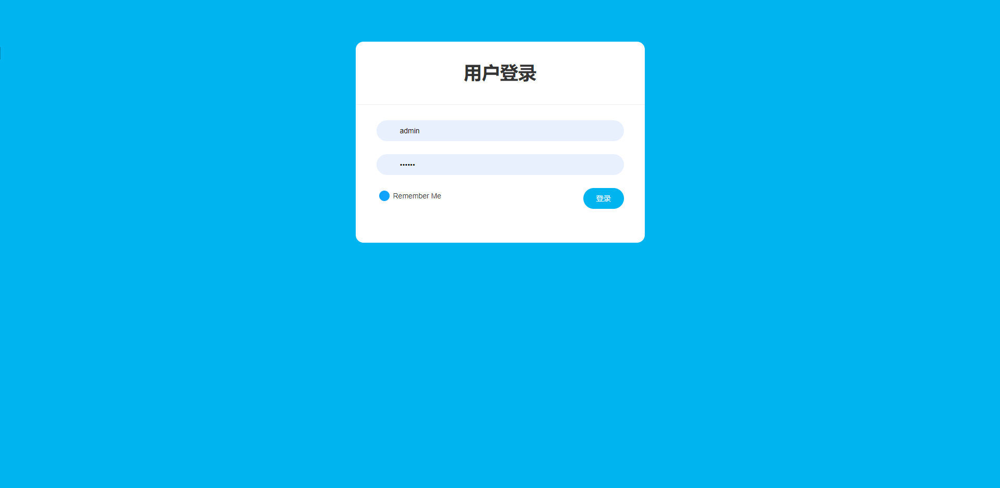
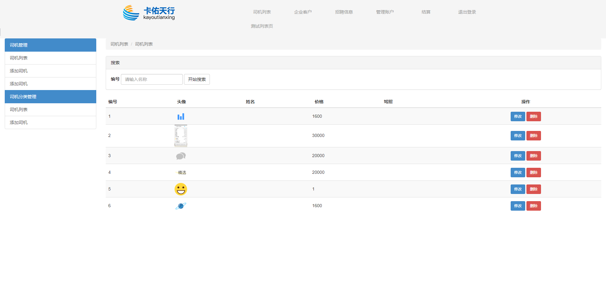
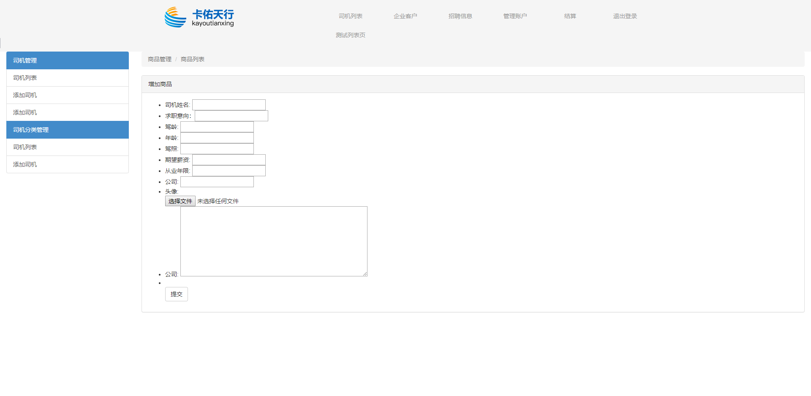
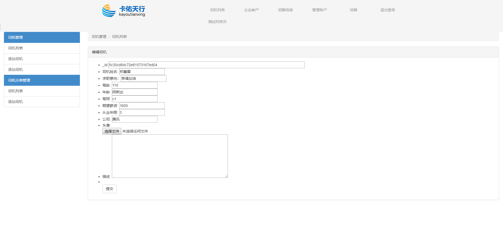

#  使用node做后台,实现简单的pc数据管理
>导语: 在学习node过程中,想着通过实践来实现一些学习到的功能,node的模块化处理,node路由的处理,ejs模板渲染
同时在node中实现一些必要的插件,与MongoDB数据的结合,实现数据的增删改查等等.
### 登录页
> 登录页实现了密码登录,过期会话操作,路由全局验证,密码前端到后端的检测,数据库对密码base64密码加密 
账号: admin 密码: 123456

### 列表页
> 列表页功能查看  修改与删除功能

### 添加页

### 添加页

> 结语: 刚起步学node时做的一个 Node小案例项目, 同时配置数据库,发布到线上等等这一系列操作,项目的难度不高,
但总体感觉麻雀虽小,五脏俱全.打下了很多知识的全局概念. 知识需要持之以恒的学习. 

**项目地址**[点击Dome地址](http://xiaochengxu.zhztest.club/admin/login "http://xiaochengxu.zhztest.club/admin/login")